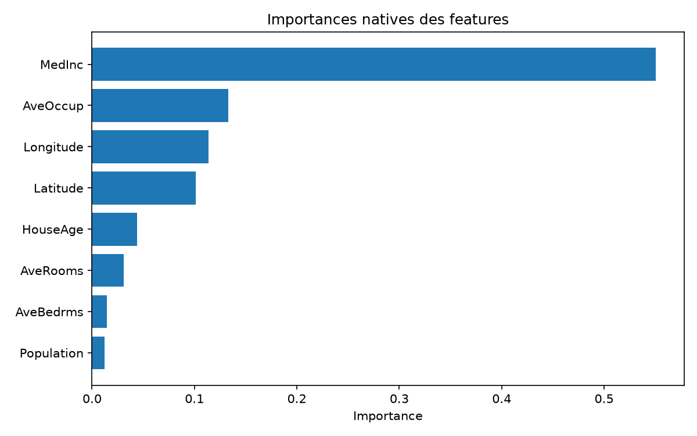
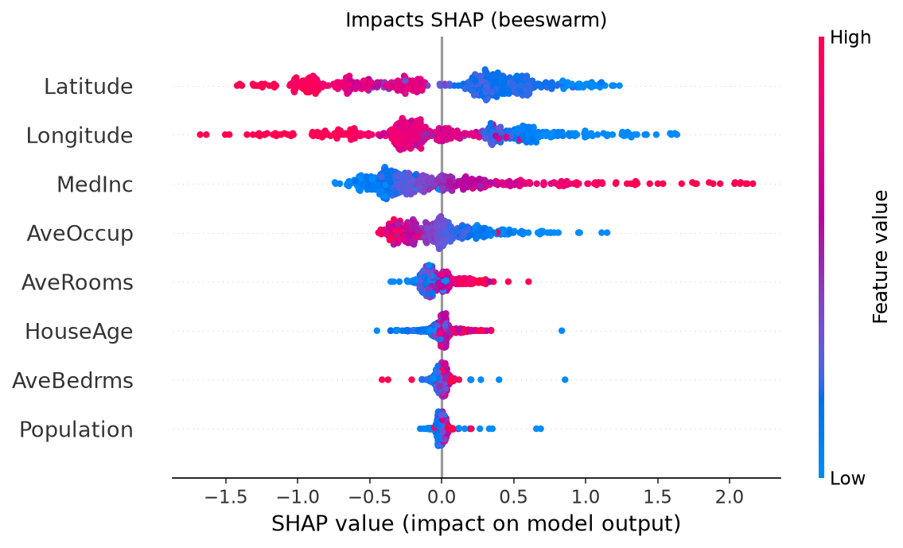
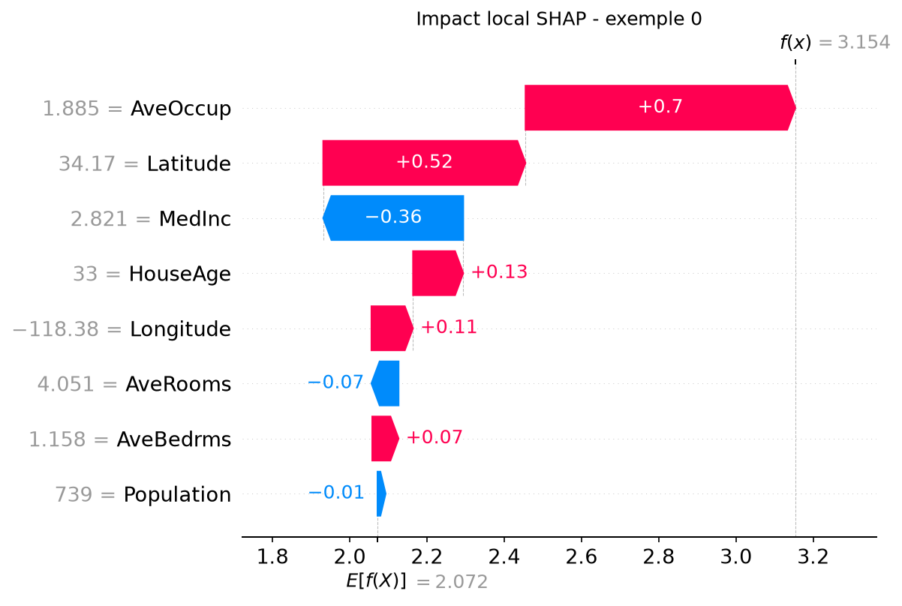
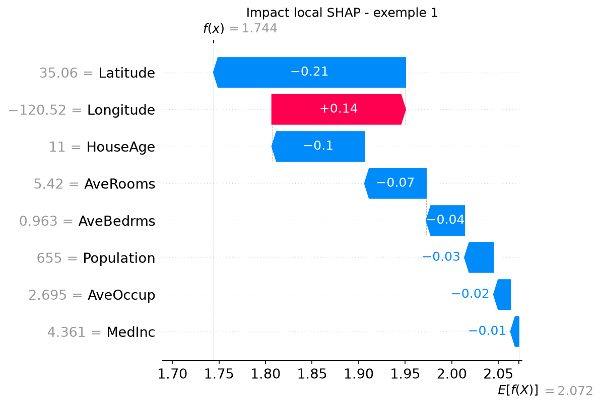
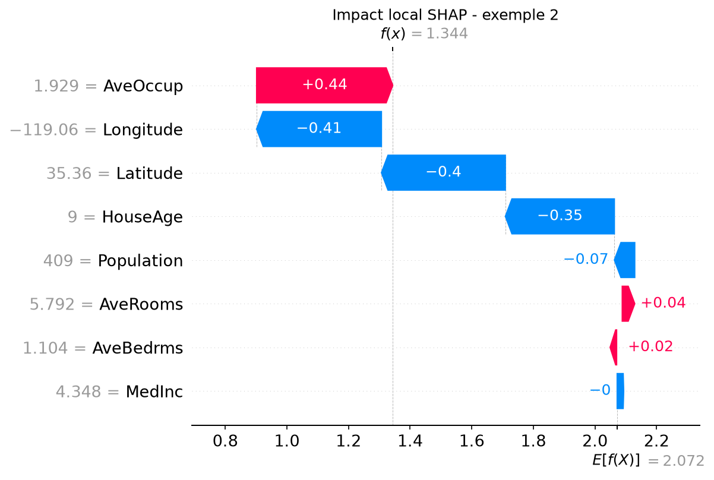

# Mission 3 — Analyse des features

## Méthode

On repars du meilleur modèle sélectionné en mission 2 (gradient boosting), chargé depuis `models/best_model.pkl`. 
Analyse l'impact des variables à deux niveaux :

- **importances globales natives** du modèle (feature_importances_) ;
- **valeurs SHAP** calculées avec TreeExplainer sur un échantillon de 500 lignes du jeu de test, pour la vue globale (beeswarm) et locale (waterfall).

La valeur de base du modèle est E[f(X)] = 2.072, soit un prix médian moyen prédit d'environ 207 000 $.

### 1. Importances globales (natives)

| feature | importance |
|---|---|
| MedInc | 0.550 |
| AveOccup | 0.133 |
| Longitude | 0.114 |
| Latitude | 0.101 |
| HouseAge | 0.044 |
| AveRooms | 0.031 |
| AveBedrms | 0.014 |
| Population | 0.012 |

Le revenu médian (MedInc) domine très largement, avec à lui seul 55 % de l'importance totale. C'est cohérent avec l'EDA, où MedInc était la variable la plus corrélée à la cible (environ 0.69). Viennent ensuite l'occupation moyenne (AveOccup) et les deux variables géographiques (Longitude + Latitude, soit environ 0.21 cumulé). Les caractéristiques de logement (AveRooms, AveBedrms) et la Population ont un poids quasi négligeable.

### 2. Vue globale SHAP (beeswarm)

Le classement SHAP diffère du classement natif : ici, Latitude et Longitude arrivent en tête, devant MedInc. Autrement dit, l'importance native (basée sur la réduction d'impureté dans les arbres) sous-estime le rôle de la localisation, que SHAP fait ressortir.

Le beeswarm donne aussi le sens des effets :

- MedInc : les valeurs élevées (rouge) ont un impact SHAP positif (jusqu'à +2) — plus le revenu du secteur est élevé, plus le prix prédit monte. Effet net et régulier.
- Latitude : les valeurs élevées (rouge, plus au nord) tirent la prédiction vers le bas ; les valeurs basses la tirent vers le haut.
- Longitude : les valeurs basses (bleu, plus à l'ouest / côté côtier) ont un impact positif — les secteurs proches de la côte sont prédits plus chers.
- AveOccup : une occupation élevée a plutôt un impact négatif sur le prix.

### 3. Impacts locaux (waterfalls)

Trois districts du jeu de test, pour montrer comment les mêmes variables agissent différemment selon le cas.

#### Exemple 0 — prédiction haute : f(x) = 3.154 (~315 000 $)

Le prix est tiré vers le haut surtout par AveOccup (+0.70, occupation faible de 1.885) et Latitude (+0.52). Fait intéressant : MedInc est ici sous la moyenne (2.821) et tire donc la prédiction vers le bas (−0.36), mais la localisation et la faible occupation compensent largement.

#### Exemple 1 — prédiction proche de la moyenne basse : f(x) = 1.744 (~174 000 $)

Aucune variable n'a d'effet fort : le district est légèrement sous la moyenne, surtout à cause de Latitude (−0.21). À noter, MedInc est au-dessus de la moyenne (4.361) mais son impact local est quasi nul (−0.01) — preuve que SHAP est contextuel : une variable globalement forte peut peser peu sur un cas précis.

#### Exemple 2 — prédiction basse : f(x) = 1.344 (~134 000 $)

L'occupation faible pousse le prix vers le haut (AveOccup +0.44), mais la géographie le tire fortement vers le bas (Longitude −0.41, Latitude −0.40) et le logement récent aussi (HouseAge −0.35). Résultat net : un  prix bas.
